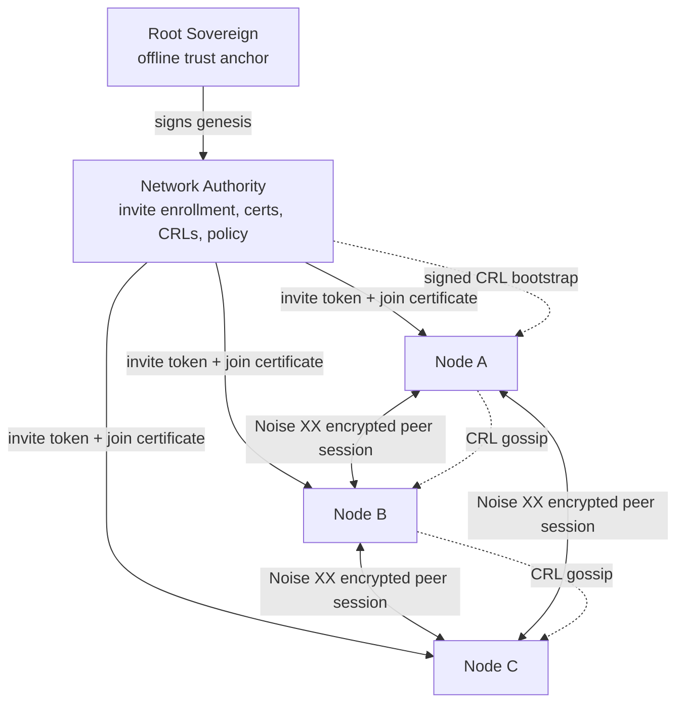

# Genesis Mesh

Genesis Mesh is a permissioned mesh-network prototype with cryptographic trust
chains, a Network Authority, peer transport, routing, CRL support, RBAC,
monitoring, and audit logging.

The repository is organized so source and runtime entry points stay at the root,
while operational scripts, generated examples, and narrative project documents
live in their own directories.

## Architecture At A Glance



## Installation

```bash
pip install -r requirements.txt
pip install -e .
```

## Quick Start

The high-level CLI is organized around three workflows.

```bash
# Operator: create keys, genesis, and config.
genesis-mesh init

# Operator: start the local Network Authority in one terminal.
genesis-mesh na start

# Browser: open the Network Authority console.
# http://127.0.0.1:8443/

# Operator: create a single-use invite in another terminal.
INVITE_TOKEN=$(genesis-mesh admin invite --role anchor)

# Node operator: enroll this machine.
genesis-mesh join --na http://127.0.0.1:8443 --token "$INVITE_TOKEN"

# Either persona: inspect configured NA and node state.
genesis-mesh status
```

PowerShell invite capture:

```powershell
$INVITE_TOKEN = genesis-mesh admin invite --role anchor
genesis-mesh join --na http://127.0.0.1:8443 --token $INVITE_TOKEN
```

For a local developer smoke test:

```bash
genesis-mesh dev up
```

Production/container startup still uses `start.sh` and Gunicorn. It requires
mounted `GENESIS_FILE` and `NA_PRIVATE_KEY_FILE` paths, plus operator public
keys through `OPERATOR_PUBLIC_KEYS_JSON`, and fails closed when either required
secret file is missing.

## Documentation

Published documentation: https://genesismesh.connectorzzz.com

The documentation site is built with Sphinx, Furo, and MyST:

```powershell
python -m pip install -r docs/requirements.txt
python -m sphinx -b html -W docs docs/pages
```

Preview the generated site with `docs/pages` as the HTTP root:

```powershell
python -m http.server 8000 --directory docs/pages
```

If you are using Git Bash on Windows, activate the repository virtual
environment first:

```bash
source .venv/Scripts/activate
python -m pip install -r docs/requirements.txt
python -m sphinx -b html -W docs docs/pages
```

The Sphinx index includes quickstart, installation, concepts, reference,
operations, and development documentation. The temporary implementation plan is
kept out of the published docs navigation.

## Repository Layout

```text
.
|-- Dockerfile              # Container image definition
|-- README.md               # Repository overview
|-- requirements.txt        # Python dependencies
|-- setup.py                # Package metadata
|-- start.sh                # Container entry point
|-- docs/                   # Sphinx documentation site
|-- examples/               # Demo workflows and checked-in genesis samples
|-- genesis_mesh/           # Python package
`-- infrastructure/         # Terraform, cloud deployment, and ops scripts
```

The package layout:

```text
genesis_mesh/
|-- audit/                  # Tamper-evident security audit logging
|-- cli/                    # Command-line tools
|-- crypto/                 # Ed25519 signing and key management
|-- gossip/                 # CRL gossip protocol
|-- models/                 # Genesis, certificate, policy, CRL, and enrollment models
|-- monitoring/             # Metrics and health checks
|-- na_service/             # Network Authority REST API and WSGI entry point
|-- node/                   # Node client, runtime, discovery, RBAC, and control handling
|-- routing/                # Routing table, protocol, and message forwarding
|-- tests/                  # Unit and runtime tests
`-- transport/              # WebSocket transport, Noise, protocol, and connections
```

## Infrastructure

Infrastructure files are consolidated under `infrastructure/`:

- Terraform modules and examples live directly under `infrastructure/`.
- Azure Container Apps helper scripts live under `infrastructure/azure/`.
- Local operational scripts live under `infrastructure/scripts/`.

`Dockerfile` and `start.sh` intentionally remain at the repository root because
standard container builders expect them there.

## Testing

```powershell
python -m pytest genesis_mesh/tests -v
```

## License

MIT
