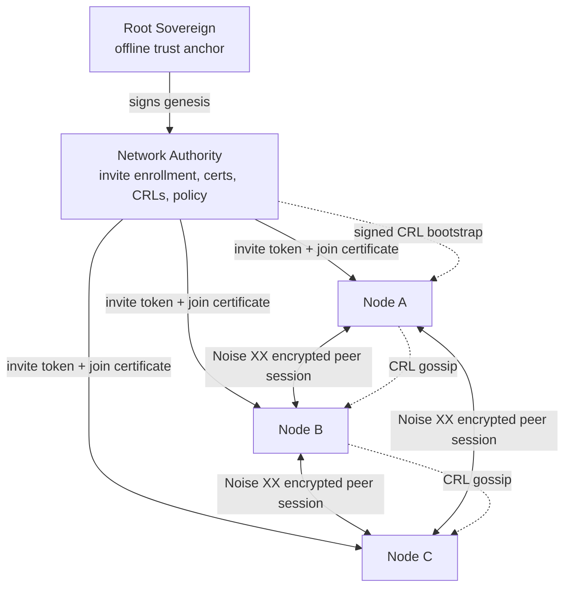

# Genesis Mesh

Genesis Mesh is a permissioned mesh network with cryptographic trust chains, a
Network Authority, Noise XX peer transport, distance-vector routing, CRL
revocation, RBAC, Prometheus metrics, and tamper-evident audit logging.

Every node holds a signed join certificate issued by the Network Authority. Peer
sessions are encrypted with the Noise XX protocol, deriving X25519 keys directly
from each node's Ed25519 identity -- no separate TLS certificate lifecycle
required.

## Architecture



## Requirements

- Python 3.12 or later
- See `requirements.txt` for pinned runtime dependencies

## Installation

```bash
python -m venv .venv
source .venv/bin/activate   # PowerShell: .\.venv\Scripts\Activate.ps1
pip install -r requirements.txt
pip install -e .
```

## Quick Start

The local workflow runs the NA in one terminal and joins a node in a second.

```bash
# Create keys, genesis block, and CLI config (one time).
genesis-mesh init

# Start the Network Authority (keep this terminal open).
genesis-mesh na start

# In a second terminal: create a single-use invite and join.
INVITE_TOKEN=$(genesis-mesh admin invite --role anchor)
genesis-mesh join --na http://127.0.0.1:8443 --token "$INVITE_TOKEN"

# Inspect NA health and node certificate state.
genesis-mesh status
```

PowerShell:

```powershell
$INVITE_TOKEN = genesis-mesh admin invite --role anchor
genesis-mesh join --na http://127.0.0.1:8443 --token $INVITE_TOKEN
```

Full local smoke test:

```bash
genesis-mesh dev up
```

## Production Deployment

Container startup uses `start.sh` and Gunicorn. Set `SERVICE_ROLE=na` for the
Network Authority or `SERVICE_ROLE=node` for a peer node. The NA role requires
two mounted secrets and fails closed if either is absent:

| Environment variable      | Description                                      |
|---------------------------|--------------------------------------------------|
| `SERVICE_ROLE`            | `na` or `node`                                   |
| `GENESIS_FILE`            | Path to the signed genesis block                 |
| `NA_PRIVATE_KEY_FILE`     | Path to the NA Ed25519 signing key (NA role)     |
| `OPERATOR_PUBLIC_KEYS_JSON` | JSON map of operator key IDs to public keys   |
| `DB_PATH`                 | SQLite database path (default: `genesis_mesh_na.db`) |
| `PORT`                    | Bind port (default: `8443`)                      |
| `WEB_CONCURRENCY`         | Gunicorn worker count (default: `4`)             |

The NA private key never leaves the NA process.

Health and readiness probes are available at `/healthz` and `/readyz`.

## Documentation

https://genesismesh.connectorzzz.com

## Repository Layout

```
.
  Dockerfile              Container image definition
  start.sh                Container entry point (NA and node roles)
  requirements.txt        Pinned runtime dependencies
  setup.py                Package metadata and entry points
  docs/                   Sphinx documentation source
  examples/               Demo workflows and sample genesis blocks
  genesis_mesh/           Python package
  infrastructure/         Terraform, Azure scripts, and operational tools
```

```
genesis_mesh/
  audit/                  Tamper-evident security audit logging
  cli/                    High-level and low-level CLI commands
  crypto/                 Ed25519 signing and key management
  gossip/                 CRL gossip protocol
  models/                 Genesis, certificate, policy, CRL, and enrollment models
  monitoring/             Prometheus metrics and health checks
  na_service/             Network Authority REST API and WSGI entry point
  node/                   Node client, runtime, discovery, RBAC, and control plane
  routing/                Routing table, protocol, and message forwarding
  tests/                  Unit and integration tests
  transport/              WebSocket transport, Noise XX, protocol framing, and connections
```

## Testing

```bash
python -m pytest genesis_mesh/tests -v
```

## Security

To report a vulnerability, open a GitHub Security Advisory on this repository.
Do not file a public issue for security-sensitive findings.

## License

[MIT](LICENSE)
