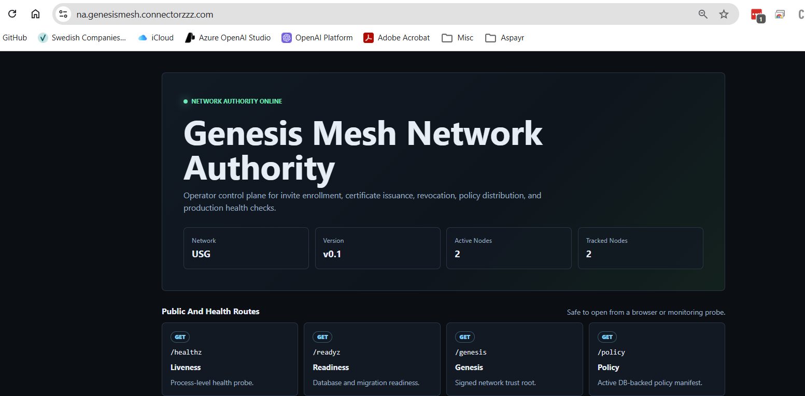
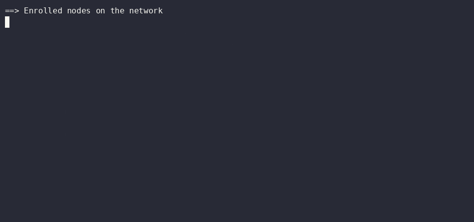
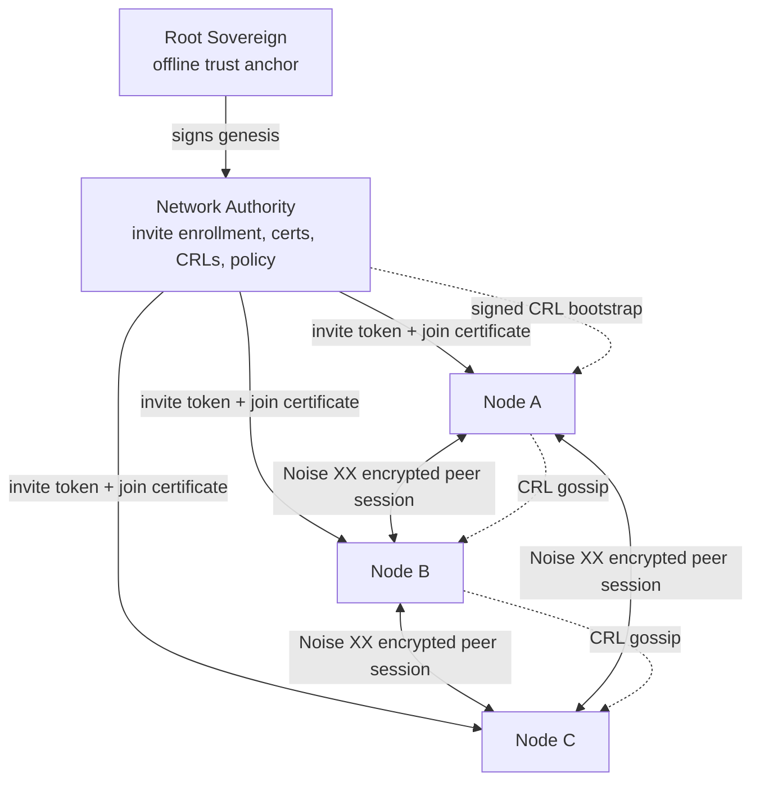

# Genesis Mesh

[](https://genesismesh.connectorzzz.com)
[](LICENSE)
[](https://github.com/thaersaidi/genesismesh/releases)

## Live Deployment

| | |
|---|---|
| Network Authority | Online |
| Public Endpoint | https://na.genesismesh.connectorzzz.com |
| Deployment | Azure VM, Sweden Central |
| TLS | Enabled |
| Active Nodes | 2 |
| Tracked Nodes | 2 |
| Remote Nodes | 1 |
| Online since | 2026-05-30 |




## Live Message Delivery

A remote local node sends a DATA message to an Azure-hosted node over a Noise XX encrypted peer session.



Evidence:
- Noise XX handshake completed
- Connection established
- Neighbor added
- DATA message delivered


**Trust can be revoked.**

A revoked node is removed from the active set, added to a signed CRL, and
immediately rejected by heartbeat, renewal, handshake, and routing checks.

Genesis Mesh treats revocation as a first-class control-plane action. When an
operator revokes a certificate, the Network Authority publishes a new signed
CRL, removes the node from the active set, and rejects further heartbeat,
renewal, peer handshake, and routing activity from that identity.

---

Genesis Mesh is a sovereign trust, identity, and communication fabric for AI
agents, edge systems, and distributed infrastructure.

It answers the operational questions that basic mesh networking leaves open:
who is allowed to be a node, how peers prove identity, what each node is
allowed to do, how messages reach the right peer, and how a compromised or
retired identity is removed.

Genesis Mesh combines five capabilities in one trust fabric:

- **Identity**: every node has an Ed25519 identity and a signed join certificate.
- **Trust**: a signed genesis block, Network Authority, operator keys, and CRLs
  define who the network trusts.
- **Routing**: authenticated peers discover routes and forward messages without
  depending on the Network Authority for every data exchange.
- **Authorization**: enrollment roles, policy manifests, RBAC, and signed admin
  actions define what identities may do.
- **Sovereignty**: the operator owns the trust chain, membership process,
  revocation process, and policy distribution path.

Every enrolled node holds a signed join certificate issued by the Network
Authority. Peer sessions are encrypted with the Noise XX protocol, deriving
X25519 keys directly from each node's Ed25519 identity. No separate TLS
certificate lifecycle is required for peer transport.

## Why It Exists

Most overlay networks focus on connectivity: can this machine reach that
machine? Genesis Mesh focuses on controlled participation: should this machine
be here, what identity is it using, what is it authorized to do, and can the
network remove it quickly?

Use Genesis Mesh when your system needs:

- a private trust domain for agents, devices, or edge services
- operator-controlled enrollment instead of open peer discovery
- certificate-backed peer authentication
- signed policy distribution
- revocation that affects heartbeats, renewal, peer handshakes, and routing
- audit trails for security-relevant control-plane actions

Do not use it when you only need public peer discovery, anonymous networking, a
general service mesh for Kubernetes ingress, or a permissionless blockchain.

## Architecture



At a high level, the Network Authority admits identities and publishes trust
state. Nodes use that state to communicate directly, route messages, and reject
revoked peers.

## Documentation

[Documentation Website](https://genesismesh.connectorzzz.com)

## Requirements

- Python 3.12 or later
- See `requirements.txt` for pinned runtime dependencies

## Installation

```bash
python -m venv .venv
source .venv/bin/activate   # PowerShell: .\.venv\Scripts\Activate.ps1
pip install -r requirements.txt
pip install -e .
```

## Quick Start

The local workflow runs the NA in one terminal and joins a node in a second.

```bash
# Create keys, genesis block, and CLI config (one time).
genesis-mesh init

# Start the Network Authority (keep this terminal open).
genesis-mesh na start

# In a second terminal: create a single-use invite and join.
INVITE_TOKEN=$(genesis-mesh admin invite --role anchor)
genesis-mesh join --na http://127.0.0.1:8443 --token "$INVITE_TOKEN"

# Inspect NA health and node certificate state.
genesis-mesh status
```

PowerShell:

```powershell
$INVITE_TOKEN = genesis-mesh admin invite --role anchor
genesis-mesh join --na http://127.0.0.1:8443 --token $INVITE_TOKEN
```

Full local smoke test:

```bash
genesis-mesh dev up
```

## Production Deployment

Container startup uses `start.sh` and Gunicorn. Set `SERVICE_ROLE=na` for the
Network Authority or `SERVICE_ROLE=node` for a peer node. The NA role requires
two mounted secrets and fails closed if either is absent:

| Environment variable      | Description                                      |
|---------------------------|--------------------------------------------------|
| `SERVICE_ROLE`            | `na` or `node`                                   |
| `GENESIS_FILE`            | Path to the signed genesis block                 |
| `NA_PRIVATE_KEY_FILE`     | Path to the NA Ed25519 signing key (NA role)     |
| `OPERATOR_PUBLIC_KEYS_JSON` | JSON map of operator key IDs to public keys   |
| `DB_PATH`                 | SQLite database path (default: `genesis_mesh_na.db`) |
| `PORT`                    | Bind port (default: `8443`)                      |
| `WEB_CONCURRENCY`         | Gunicorn worker count (default: `4`)             |

The NA private key never leaves the NA process.

Health and readiness probes are available at `/healthz` and `/readyz`.

## Repository Layout

```
.
  Dockerfile              Container image definition
  start.sh                Container entry point (NA and node roles)
  requirements.txt        Pinned runtime dependencies
  setup.py                Package metadata and entry points
  docs/                   Sphinx documentation source
  examples/               Demo workflows and sample genesis blocks
  genesis_mesh/           Python package
  infrastructure/         Terraform, Azure scripts, and operational tools
```

```
genesis_mesh/
  audit/                  Tamper-evident security audit logging
  cli/                    High-level and low-level CLI commands
  crypto/                 Ed25519 signing and key management
  gossip/                 CRL gossip protocol
  models/                 Genesis, certificate, policy, CRL, and enrollment models
  monitoring/             Prometheus metrics and health checks
  na_service/             Network Authority REST API and WSGI entry point
  node/                   Node client, runtime, discovery, RBAC, and control plane
  routing/                Routing table, protocol, and message forwarding
  tests/                  Unit and integration tests
  transport/              WebSocket transport, Noise XX, protocol framing, and connections
```

## Testing

```bash
python -m pytest genesis_mesh/tests -v
```

## Security

To report a vulnerability, open a GitHub Security Advisory on this repository.
Do not file a public issue for security-sensitive findings.

## License

[MIT](LICENSE)
