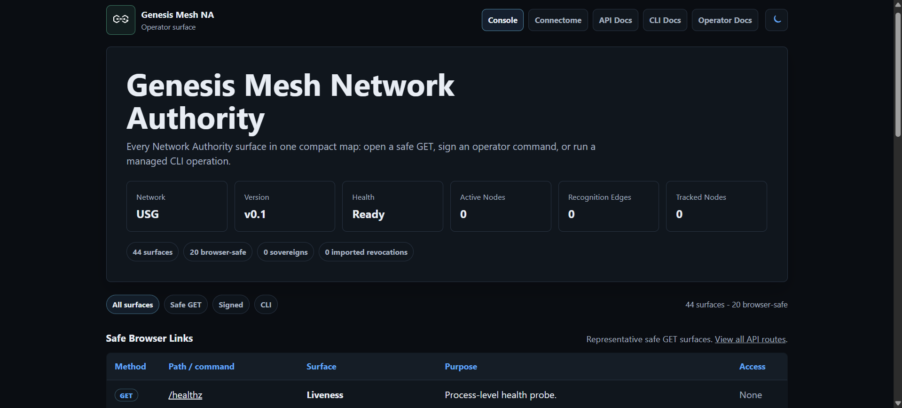
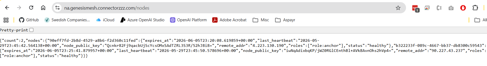

# Deployment Options

Genesis Mesh supports four deployment shapes. Pick the one that matches your
operational target.

```{mermaid}
flowchart TB
    secrets["Mounted secrets<br/>genesis.signed.json + na.key"]
    operator["OPERATOR_PUBLIC_KEYS_JSON"]
    container["Genesis Mesh container"]
    gunicorn["Gunicorn"]
    flask["Network Authority app"]
    sqlite["SQLite DB on durable volume"]
    ingress["Ingress / TLS termination"]

    ingress --> gunicorn
    gunicorn --> flask
    flask --> sqlite
    secrets -->|GENESIS_FILE, NA_PRIVATE_KEY_FILE| container
    operator --> container
    container --> gunicorn
```

## Live Deployment

A public Network Authority runs on Azure (Sweden Central):

**[https://na.genesismesh.connectorzzz.com](https://na.genesismesh.connectorzzz.com)**

### Architecture

- Azure VM (Terraform provisioned, `Standard_B2ts_v2`, Sweden Central)
- Nginx with TLS termination (Let's Encrypt)
- Gunicorn (4 workers, sync worker class)
- Genesis Mesh Network Authority (systemd-managed `genesis-mesh-na.service`)
- SQLite persistence on a durable disk
- Public endpoint: [https://na.genesismesh.connectorzzz.com](https://na.genesismesh.connectorzzz.com)

Two enrolled nodes from separate IP addresses with active heartbeats.





---

## 1. Local Process

The fastest way to run a Network Authority. Suitable for development, demos,
and CI smoke tests.

```bash
genesis-mesh init
genesis-mesh na start
```

`genesis-mesh na start` uses the Flask development server. For production
container or VM startup, use Gunicorn through `start.sh`.

See: [In-process smoke demo](../examples/demos.md#9-in-process-smoke-demo) and
[Live CLI process smoke demo](../examples/demos.md#10-live-cli-process-smoke-demo)

## 2. Docker

The container entry point is `start.sh`. In Network Authority mode it runs
Gunicorn and requires mounted genesis and NA key files.

```bash
docker run --rm \
  -e SERVICE_ROLE=na \
  -e GENESIS_FILE=/run/secrets/genesis.signed.json \
  -e NA_PRIVATE_KEY_FILE=/run/secrets/na.key \
  -e OPERATOR_PUBLIC_KEYS_JSON='{"operator-local":"<base64-public-key>"}' \
  -e DB_PATH=/data/genesis_mesh_na.db \
  -p 8443:8443 \
  genesis-mesh:local
```

For multi-container orchestration with a writable database volume, use the
included Docker Compose example.

See: [Docker image smoke demo](../examples/demos.md#11-docker-image-smoke-demo)
and [Docker Compose example](../examples/demos.md#12-docker-compose-network-authority-example)

## 3. Kubernetes

A minimal set of manifests is provided under `examples/kubernetes/`:

```bash
kubectl apply -f examples/kubernetes/namespace.yaml
kubectl apply -f examples/kubernetes/na-secrets.yaml
kubectl apply -f examples/kubernetes/na-pvc.yaml
kubectl apply -f examples/kubernetes/na-deployment.yaml
kubectl apply -f examples/kubernetes/na-service.yaml
```

The Deployment runs a single non-root replica, mounts the genesis block and NA
key as a `Secret`, and persists the SQLite database to a `PersistentVolumeClaim`.

See: [Kubernetes deployment guide](kubernetes-deployment.md) and
[examples/kubernetes/README.md](https://github.com/thaersaidi/genesismesh/tree/main/examples/kubernetes)

## 4. Terraform on Azure

The `infrastructure/azure/` directory contains a self-contained Terraform module
that provisions a complete Network Authority environment on Azure: resource
group, virtual network, subnet, public IP, NSG, network interface, and an Ubuntu
22.04 VM.

```bash
cd infrastructure/azure
terraform init \
  -backend-config="resource_group_name=terraform-state-rg" \
  -backend-config="storage_account_name=tfstategenesismesh" \
  -backend-config="container_name=tfstate" \
  -backend-config="key=genesis-mesh-na.tfstate"
terraform apply
```

The same module is driven from CI via
`.github/workflows/deploy-azure.yml`, which is how the live deployment at
`https://na.genesismesh.connectorzzz.com` was provisioned.

See: [Terraform deployment guide](terraform-deployment.md)

## Production Readiness Checks

Before promoting any of the deployment shapes above to production:

- the container starts as a non-root user
- required secret files are mounted
- startup fails closed when required secret files are missing
- `/healthz` and `/readyz` work behind the selected ingress
- SQLite data is persisted on durable storage
- backups are tested
- operator public keys are reviewed and rotated through policy
- logs do not expose private key material

Do not run two Network Authority processes against the same SQLite database
file. Genesis Mesh treats SQLite as a single-writer deployment store.
