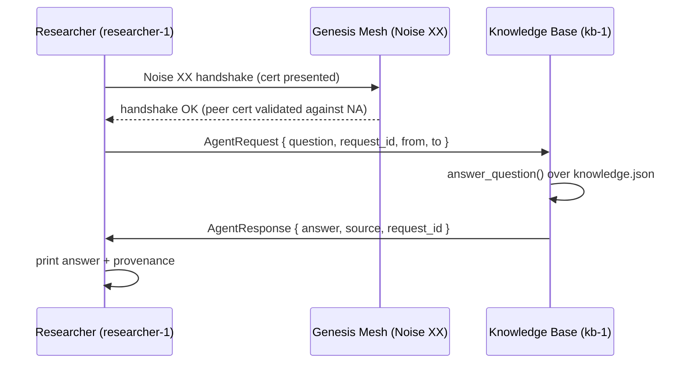
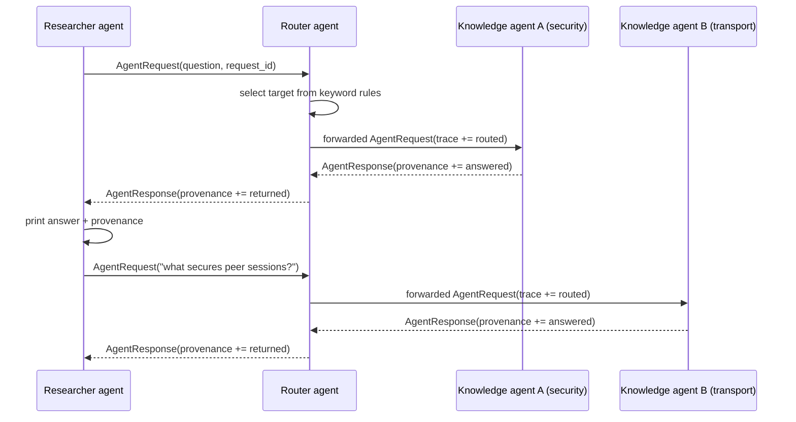

# Agent Network Example

Two agents communicate over Genesis Mesh:

- **Knowledge Base agent** (`kb-1`) — long-running, listens on a peer
  WebSocket port, answers questions from a JSON knowledge file
- **Researcher agent** (`researcher-1`) — one-shot, sends a question and
  prints the answer



## Why this example exists

The bare `genesis-mesh send` command proves *transport*: a node can send
bytes to another node over an encrypted, authenticated session. This example
proves *semantics*: two agents with distinct roles can have a structured
conversation where the receiver knows who asked, why, and can produce a
signed-by-mesh-identity reply.

What the mesh layer guarantees, with no additional code:

| Property | Where it comes from |
|---|---|
| The responder's identity is unforgeable | Join certificate signed by the Network Authority |
| Nobody else can read the conversation | Noise XX session keys (perfect forward secrecy) |
| A revoked agent cannot respond | CRL enforcement on peer handshake |
| The application doesn't depend on any third-party trust broker | Genesis block + NA |

That last point matters most. Most "agent network" demos rely on someone
(OpenAI, Anthropic, a vendor cloud) being the implicit identity provider.
This example uses your own NA.

## What you need before running

1. A live Network Authority. The public one at
   `https://na.genesismesh.connectorzzz.com` works if you have operator
   credentials or pre-issued invite tokens. Otherwise, spin up a local one
   with `genesis-mesh init && genesis-mesh na start`.
2. An invite token for each agent — get one with:
   ```bash
   genesis-mesh admin invite --role anchor
   ```
3. A reachable peer endpoint for the researcher to connect through.
   Any node listening on a peer port works — the live deployment exposes
   router B at `ws://4.223.130.190:7443`.

## Quick start against the live deployment

In **terminal 1**, start the knowledge-base agent (this enrols once and
then listens):

```bash
KB_INVITE=$(genesis-mesh admin invite --role anchor)

python examples/agent-network/knowledge_base.py \
  --na https://na.genesismesh.connectorzzz.com \
  --config ~/.gm-agents/kb/config.toml \
  --listen-port 7445 \
  --agent-id kb-1 \
  --invite-token "$KB_INVITE"
```

The agent prints its **identity prefix** on startup. Capture the full
public key — you need it as `--destination-key` below. The simplest way:

```bash
cat ~/.gm-agents/kb/node.cert.json | python3 -c "import json,sys; print(json.load(sys.stdin)['node_public_key'])"
```

In **terminal 2**, run the researcher with a single question:

```bash
RES_INVITE=$(genesis-mesh admin invite --role client)

python examples/agent-network/researcher.py \
  --na https://na.genesismesh.connectorzzz.com \
  --config ~/.gm-agents/researcher/config.toml \
  --to-agent kb-1 \
  --destination-key "<paste public key from above>" \
  --via ws://4.223.130.190:7443 \
  --invite-token "$RES_INVITE" \
  "what protocol secures peer sessions?"
```

Output (captured from a real run against
[https://na.genesismesh.connectorzzz.com](https://na.genesismesh.connectorzzz.com)):

```
Genesis block signatures verified successfully
Node initialized for network: USG
Requesting join certificate from https://na.genesismesh.connectorzzz.com
Received valid join certificate: 8614db72-7864-4eac-88e7-e28634446c92
Valid until: 2026-06-01 22:58:57.360919+00:00
Opening Noise XX session to ws://localhost:7446
Derived Noise Protocol name Noise_XX_25519_AESGCM_SHA256
WriteMessage(payload, message_buffer)
ReadMessage(message, payload_buffer)
WriteMessage(payload, message_buffer)
[adfde277-bd07-4d8a-a5c9-e471360b652a] sending question to kb-1: 'what protocol secures peer sessions?'

Q: what protocol secures peer sessions?
A: Noise XX, deriving X25519 keys directly from each node's Ed25519 identity. No separate TLS certificate lifecycle is required.
  from:    kb-1
  source:  knowledge-security.json
  request: adfde277-bd07-4d8a-a5c9-e471360b652a
```

Knowledge-base side, same exchange:

```
DATA message delivered | from=fP7HbAUnyGzUt6l0 | content='{"question": "what protocol secures peer sessions?", "from_agent": "researcher-1", "to_agent": "kb-1", "request_id": "adfde277-...", "type": "ask"}'
[adfde277-bd07-4d8a-a5c9-e471360b652a] received question from researcher-1: 'what protocol secures peer sessions?'
[adfde277-bd07-4d8a-a5c9-e471360b652a] sent answer to fP7HbAUnyGzUt6l0
```

After first-run enrollment, the certificates are saved to disk. Subsequent
calls don't need `--invite-token` and reuse the existing cert. From a real
follow-up run:

```
Q: how does revocation work
A: An operator calls /admin/revoke. The Network Authority publishes a new signed CRL. Heartbeat, renewal, peer handshake, and routing checks all reject the revoked identity.
  from:    kb-1
  source:  knowledge.json
```

## Multi-agent workflow: researcher -> router -> knowledge agents

The two-agent example proves direct structured messaging. The router example
adds one more hop so the mesh carries a cooperative workflow:



This demonstrates the agent-network properties Genesis Mesh is meant to carry:

- one agent can route work to another agent;
- the requester keeps the same `request_id` across multiple hops;
- every participant has its own mesh identity and join certificate;
- responses preserve the producing agent in `from_agent`;
- provenance records routing and answer steps;
- revocation still breaks the workflow because a revoked router or knowledge
  agent cannot complete the peer handshake or keep participating in routing.

Start two knowledge agents with different knowledge files:

```bash
SEC_INVITE=$(genesis-mesh admin invite --role anchor)
TX_INVITE=$(genesis-mesh admin invite --role anchor)

python examples/agent-network/knowledge_base.py \
  --na https://na.genesismesh.connectorzzz.com \
  --config ~/.gm-agents/kb-security/config.toml \
  --listen-port 7447 \
  --agent-id kb-security \
  --knowledge examples/agent-network/knowledge-security.json \
  --invite-token "$SEC_INVITE"

python examples/agent-network/knowledge_base.py \
  --na https://na.genesismesh.connectorzzz.com \
  --config ~/.gm-agents/kb-transport/config.toml \
  --listen-port 7448 \
  --agent-id kb-transport \
  --knowledge examples/agent-network/knowledge-transport.json \
  --invite-token "$TX_INVITE"
```

Capture both node public keys from their saved certificates:

```bash
SEC_KEY=$(cat ~/.gm-agents/kb-security/node.cert.json | python3 -c "import json,sys; print(json.load(sys.stdin)['node_public_key'])")
TX_KEY=$(cat ~/.gm-agents/kb-transport/node.cert.json | python3 -c "import json,sys; print(json.load(sys.stdin)['node_public_key'])")
```

Start the router and point keyword rules at those knowledge agents:

```bash
ROUTER_INVITE=$(genesis-mesh admin invite --role anchor)

python examples/agent-network/router_agent.py \
  --na https://na.genesismesh.connectorzzz.com \
  --config ~/.gm-agents/router/config.toml \
  --listen-port 7446 \
  --agent-id router-1 \
  --knowledge-agent "kb-security=$SEC_KEY" \
  --knowledge-agent "kb-transport=$TX_KEY" \
  --rule revocation=kb-security \
  --rule crl=kb-security \
  --rule noise=kb-transport \
  --rule routing=kb-transport \
  --peer ws://127.0.0.1:7447 \
  --peer ws://127.0.0.1:7448 \
  --invite-token "$ROUTER_INVITE"
```

Capture the router's node public key, then ask the router instead of a
knowledge agent:

```bash
ROUTER_KEY=$(cat ~/.gm-agents/router/node.cert.json | python3 -c "import json,sys; print(json.load(sys.stdin)['node_public_key'])")
RES_INVITE=$(genesis-mesh admin invite --role client)

python examples/agent-network/researcher.py \
  --na https://na.genesismesh.connectorzzz.com \
  --config ~/.gm-agents/researcher/config.toml \
  --to-agent router-1 \
  --destination-key "$ROUTER_KEY" \
  --via ws://127.0.0.1:7446 \
  --invite-token "$RES_INVITE" \
  "how does revocation work?"
```

The answer still comes from the knowledge agent that produced it, while the
provenance shows the router hop:

```text
Q: how does revocation work?
A: Revocation starts with an operator-signed admin action. The Network Authority publishes a signed CRL, and heartbeat, renewal, peer handshake, and routing checks reject the revoked identity.
  from:    kb-security
  source:  knowledge.json
  request: 3f4f4c8f-8df2-4ef2-95e7-6b60c0d94d01
  provenance:
    - router-1: routed (researcher-1 -> kb-security)
    - kb-security: answered (knowledge-security.json)
    - router-1: returned (kb-security -> researcher-1)
```

The default backend returns a fallback when no entry matches, and the
`source` field shifts to `knowledge.json:default` so the caller can
distinguish a real answer from a fallback:

```
Q: what is the airspeed velocity of an unladen swallow
A: I don't have a specific answer for that question yet. Knowledge can be extended by editing knowledge.json or pointing the responder at a different backend.
  from:    kb-1
  source:  knowledge.json:default
```

## What's actually happening on the wire

1. Researcher opens a Noise XX session to the peer endpoint (router B).
   The handshake exchanges signed join certificates; both sides verify
   the other against the NA-signed genesis block.
2. Researcher addresses an `AgentRequest` envelope to the knowledge
   base's **node public key**. The mesh routes the DATA frame to that
   destination.
3. Knowledge base receives the DATA frame via its `on_data_received`
   callback. The application code parses the envelope, looks up an
   answer, and sends an `AgentResponse` back over the same session.
4. Researcher reads frames until it sees the matching `request_id`.

No application-level signing is needed. The cryptographic statement "this
answer arrived over an authenticated session with kb-1's certificate" is
sufficient for most use cases. If your threat model needs non-repudiation
across the whole chain (cross-agent forwarding, audit logs presented to a
third party), add signing at the application layer.

## Extending: swap the responder for an LLM

The default responder is a literal keyword lookup against `knowledge.json`.
Replace `answer_question` in `knowledge_base.py` with any callable that
takes a string and returns `(answer, source)`. The source string is
recorded in the response envelope, so the researcher learns whether the
answer came from a knowledge file, an LLM, a database, etc.

A minimal Anthropic example:

```python
from anthropic import Anthropic

client = Anthropic()

def answer_question(question: str, knowledge: dict) -> tuple[str, str]:
    msg = client.messages.create(
        model="claude-sonnet-4-6",
        max_tokens=1024,
        messages=[{"role": "user", "content": question}],
    )
    return msg.content[0].text, "llm:claude-sonnet-4-6"
```

Nothing about the mesh layer changes. Identity, authentication, routing,
and revocation continue to work.

## Extending: add more agents

`knowledge.json` is per-agent. Run several knowledge bases with different
`--agent-id` and different knowledge files; the researcher picks who to
ask by setting `--to-agent` and `--kb-key`.

For a richer demo, build a small router agent that knows which kb-N owns
which subject and forwards requests accordingly. That is real agent-mesh
behavior and uses the same `on_data_received` API.

## Files

| File | Purpose |
|---|---|
| `agent_protocol.py` | `AgentRequest` and `AgentResponse` JSON envelopes |
| `knowledge_base.py` | Long-running responder using `MeshNodeRuntime(on_data_received=...)` |
| `router_agent.py` | Router agent that forwards requests to knowledge agents and preserves provenance |
| `researcher.py` | One-shot asker that opens a direct Noise XX session |
| `knowledge.json` | Tiny default knowledge file the responder reads |
| `knowledge-security.json` | Security-focused knowledge file for the multi-agent workflow |
| `knowledge-transport.json` | Transport-focused knowledge file for the multi-agent workflow |
